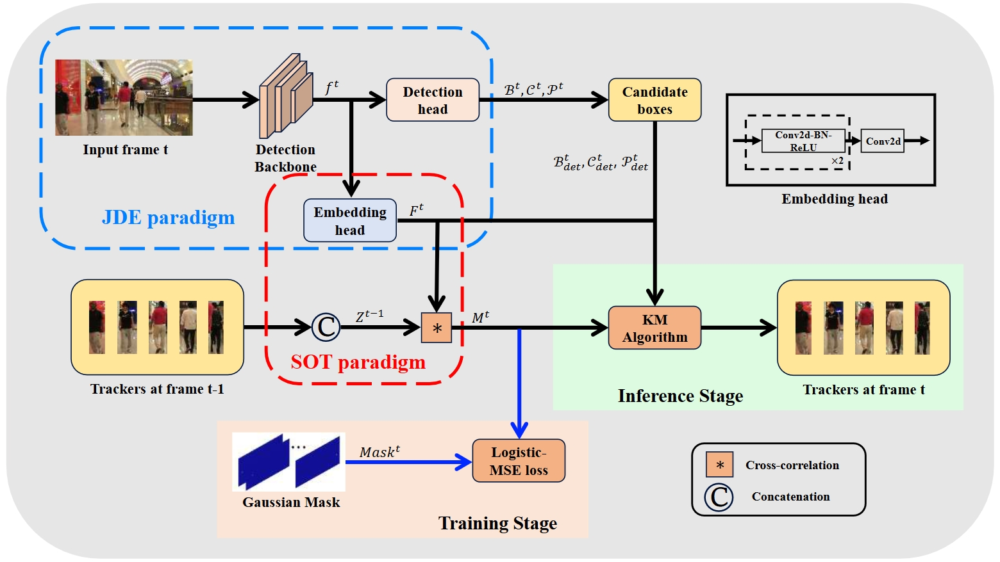

# TCBTrack

This repository contains the details of the Pytorch implementation of the Baseline Method TCBTrack of the Paper: [Temporal Correlation Meets Embedding: Towards a 2nd Generation of JDE-based Real-Time Multi-Object Tracking](https://arxiv.org/abs/2407.14086).


## Abstract

Joint Detection and Embedding(JDE) trackers have demonstrated excellent performance in Multi-Object Tracking(MOT) tasks by incorporating the extraction of appearance features as auxiliary tasks through embedding Re-Identification task(ReID) into the detector, achieving a balance between inference speed and tracking performance. However, solving the competition between the detector and the feature extractor has always been a challenge. Also, the issue of directly embedding the ReID task into MOT has remained unresolved. The lack of high discriminability in appearance features results in their limited utility. In this paper, we propose a new learning approach using cross-correlation to capture temporal information of objects. The feature extraction network is no longer trained solely on appearance features from each frame but learns richer motion features by utilizing feature heatmaps from consecutive frames, addressing the challenge of inter-class feature similarity. Furthermore, we apply our learning approach to a more lightweight feature extraction network, and treat the feature matching scores as strong cues rather than auxiliary cues, employing a appropriate weight calculation to reflect the compatibility between our obtained features and the MOT task. Our tracker, named TCBTrack, achieves state-of-the-art performance on multiple public benchmarks, i.e., MOT17, MOT20, and DanceTrack datasets. Specifically, on the DanceTrack test set, we achieve 56.8 HOTA, 58.1 IDF1 and 92.5 MOTA, making it the best online tracker that can achieve real-time performance. Comparative evaluations with other trackers prove that our tracker achieves the best balance between speed, robustness and accuracy.


## Installation
### 1. Installing on the host machine
Step1. Install ByteTrack.
```shell
git clone https://github.com/yfzhang1214/TCBTrack.git
cd TCBTrack/TCB
pip3 install -r requirements.txt
python3 setup.py develop
```

Step2. Install [pycocotools](https://github.com/cocodataset/cocoapi).

```shell
pip3 install cython; pip3 install 'git+https://github.com/cocodataset/cocoapi.git#subdirectory=PythonAPI'
```

Step3. Others
```shell
pip3 install cython_bbox
```

## Data preparation
Please follow the data preparation of [DanceTrack](https://github.com/DanceTrack/DanceTrack) and [ByteTrack](https://github.com/ifzhang/ByteTrack).

## Tracking
We provide the trained models in [Baidu Drive](https://pan.baidu.com/s/1oOc9-GGXzYBVBcrLaFjFoQ) (code:xx6j). After downloading the pretrained models, you can put them under <TCBTrack_HOME>/TCB/models.

* **Evaluation on DanceTrack validation set**

Obtain the results of validation set:
```shell
cd <TCBTrack_HOME>/TCB
python3 tools/track2.py -f exps/example/mot/dancetrack.py -c models/dancetrack.pth.tar -b 1 -d 1 --fp16 --fuse
```

Evaluation:


```shell
cd <TCBTrack_HOME>
python3 TrackEval/scripts/run_mot_challenge.py --SPLIT_TO_EVAL val  --METRICS HOTA CLEAR Identity  --GT_FOLDER dancetrack/val --SEQMAP_FILE dancetrack/val_seqmap.txt --SKIP_SPLIT_FOL True   --TRACKERS_TO_EVAL '' --TRACKER_SUB_FOLDER ''  --USE_PARALLEL True --NUM_PARALLEL_CORES 8 --PLOT_CURVES False --TRACKERS_FOLDER val/TRACKER_NAME 
```

You can get about 54.6 HOTA, 89.9 MOTA and 54.7 IDF1 using our pretrained model.

* **Evaluation on MOT17 half-val set**

Modify mot evaluator in TCB/yolox/\__init__.py and run:
```shell
cd <TCBTrack_HOME>/TCB
python3 tools/track2.py -f exps/example/mot/mot17.py -c models/mot17.pth.tar -b 1 -d 1 --fp16 --fuse
cd ..
python3 TrackEval/scripts/run_mot_challenge.py --SPLIT_TO_EVAL val  --METRICS HOTA CLEAR Identity  --GT_FOLDER TCB/datasets/mot/val --SEQMAP_FILE TCB/datasets/mot/val_seqmap.txt --SKIP_SPLIT_FOL True   --TRACKERS_TO_EVAL '' --TRACKER_SUB_FOLDER ''  --USE_PARALLEL True --NUM_PARALLEL_CORES 8 --PLOT_CURVES False --TRACKERS_FOLDER val/TRACKER_NAME 
```
* **Evaluation on MOT20 validation set**

Modify mot evaluator in TCB/yolox/\__init__.py and run:
```shell
cd <TCBTrack_HOME>/TCB
python3 tools/track2.py -f exps/example/mot/mot20.py -c models/mot20.pth.tar -b 1 -d 1 --fp16 --fuse
cd ..
python3 TrackEval/scripts/run_mot_challenge.py --SPLIT_TO_EVAL val  --METRICS HOTA CLEAR Identity  --GT_FOLDER TCB/datasets/MOT20/val --SEQMAP_FILE TCB/datasets/MOT20/val_seqmap.txt --SKIP_SPLIT_FOL True   --TRACKERS_TO_EVAL '' --TRACKER_SUB_FOLDER ''  --USE_PARALLEL True --NUM_PARALLEL_CORES 8 --PLOT_CURVES False --TRACKERS_FOLDER val/TRACKER_NAME 
```

## Training
For the training of the detector, please follow the training process of [ByteTrack](https://github.com/ifzhang/ByteTrack). For the training of the feature extractor, run:
* **Training on DanceTrack training set**
```shell
cd <TCBTrack_HOME>/TCB
python3 tools/train2.py -f exps/example/mot/dancetrack.py -d 4 -b 16 --fp16 -o- c pretrained/dancetrack.pth.tar
```
* **Training on MOT17 half-train set**
```shell
cd <TCBTrack_HOME>/TCB
python3 tools/train2.py -f exps/example/mot/mot17.py -d 4 -b 16 --fp16 -o- c pretrained/mot17.pth.tar
```
* **Training on MOT20 training set**
```shell
cd <TCBTrack_HOME>/TCB
python3 tools/train2.py -f exps/example/mot/mot20.py -d 4 -b 16 --fp16 -o- c pretrained/mot20.pth.tar
```

## Testing
* **DanceTrack**

Set testdev=True in TCB/exps/example/mot/dancetrack.py and run:
```shell
python3 tools/track2.py -f exps/example/mot/dancetrack.py -c models/dancetrack.pth.tar -b 1 -d 1 --fp16 --fuse
```
The results are in YOLOX_outputs/dancetrack. 
* **MOT17**

Set testdev=True in TCB/exps/example/mot/mot17.py and run:
```shell
python3 tools/track2.py -f exps/example/mot/mot17.py -c models/mot17.pth.tar -b 1 -d 1 --fp16 --fuse
```
The results are in YOLOX_outputs/mot17.
* **MOT20**

Set testdev=True in TCB/exps/example/mot/mot20.py and run:
```shell
python3 tools/track2.py -f exps/example/mot/mot20.py -c models/mot20.pth.tar -b 1 -d 1 --fp16 --fuse
```
The results are in YOLOX_outputs/mot20. For all of the tracking results, you can also use linear interpolation for better performance:
```shell
python3 tools/interpolation.py
```

## Acknowledgement
A large part of the code is borrowed from [ifzhang/ByteTrack](https://github.com/ifzhang/ByteTrack) and [DanceTrack/DanceTrack](https://github.com/DanceTrack/DanceTrack). Thanks for their wonderful works.
